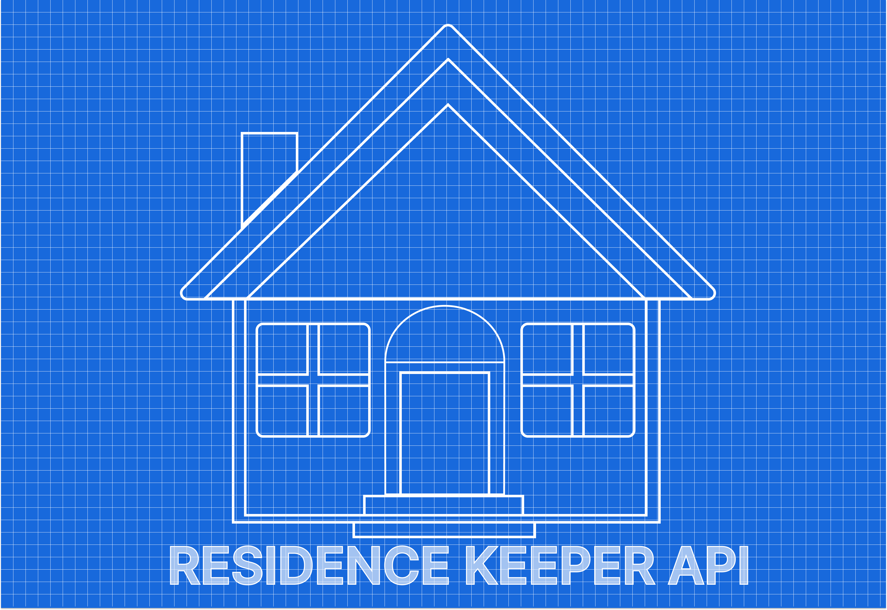

<h1 align="center">⚙️ Residence Keeper API ⚙️</h1>
<div align="center">
  
</br>
<p>
  
  <a href="https://github.com/Psykoxen/ResidenceKeeper#readme" target="_blank">
    
  </a>
  <a href="https://github.com/Psykoxen/ResidenceKeeper/graphs/commit-activity" target="_blank">
    
  </a>
  
</p>

**Best tool to follow you home expense, share a budget and well manage your home or your travel**

</div>

## API Routes

### User Routes

#### Get All Users

- **Endpoint**: `/user/`
- **Method**: GET
- **Description**: Retrieves a list of all users.

#### Create User

- **Endpoint**: `/user/create`
- **Method**: POST
- **Description**: Creates a new user.

#### User Login

- **Endpoint**: `/user/login`
- **Method**: POST
- **Description**: Allows a user to log in with their email and password.

#### Import Users

- **Endpoint**: `/user/import`
- **Method**: GET
- **Description**: Imports users.

#### Export Users

- **Endpoint**: `/user/export`
- **Method**: GET
- **Description**: Exports users.

### Home Routes

#### Get All Homes

- **Endpoint**: `/home/`
- **Method**: GET
- **Description**: Retrieves a list of all homes.

#### Create Home

- **Endpoint**: `/home/create`
- **Method**: POST
- **Description**: Creates a new home.

#### Add Resident to Home

- **Endpoint**: `/home/addresidents`
- **Method**: POST
- **Description**: Adds a resident to a home.

#### Get Home Residents

- **Endpoint**: `/home/getresidents`
- **Method**: POST
- **Description**: Retrieves the residents of a home.

#### Get Homes by Resident

- **Endpoint**: `/home/gethomesresident`
- **Method**: POST
- **Description**: Retrieves homes where a user is a resident.

#### Get Residence Details

- **Endpoint**: `/home/getresidence`
- **Method**: POST
- **Description**: Retrieves details of a home by ID.

#### Import Homes

- **Endpoint**: `/home/import`
- **Method**: GET
- **Description**: Imports homes.

#### Export Homes

- **Endpoint**: `/home/export`
- **Method**: GET
- **Description**: Exports homes.

### Payment Routes

#### Get All Payments

- **Endpoint**: `/payment/`
- **Method**: GET
- **Description**: Retrieves a list of all payments.

#### Create Payment

- **Endpoint**: `/payment/create`
- **Method**: POST
- **Description**: Creates a new payment.

#### Get Payments by User

- **Endpoint**: `/payment/user`
- **Method**: POST
- **Description**: Retrieves payments associated with a user.

#### Delete Payment

- **Endpoint**: `/payment/delete`
- **Method**: DELETE
- **Description**: Deletes a payment by ID.

#### Import Payments

- **Endpoint**: `/payment/import`
- **Method**: GET
- **Description**: Imports payments.

#### Export Payments

- **Endpoint**: `/payment/export`
- **Method**: GET
- **Description**: Exports payments.

### Category Routes

#### Get All Categories

- **Endpoint**: `/category/`
- **Method**: GET
- **Description**: Retrieves a list of all categories.

#### Create Category

- **Endpoint**: `/category/create`
- **Method**: POST
- **Description**: Creates a new category.

#### Delete Category

- **Endpoint**: `/category/delete`
- **Method**: POST
- **Description**: Deletes a category by ID.

#### Get Category by ID

- **Endpoint**: `/category/getcategory`
- **Method**: POST
- **Description**: Retrieves a category by ID.

#### Import Categories

- **Endpoint**: `/category/import`
- **Method**: GET
- **Description**: Imports categories.

#### Export Categories

- **Endpoint**: `/category/export`
- **Method**: GET
- **Description**: Exports categories.

## Install

```sh
npm install
```

## Usage

```sh
npm run start
```

## Run tests

```sh
npm run test
```

## Author

👤 **Antoine Voillot**

- Github: [@Psykoxen](https://github.com/Psykoxen)
- LinkedIn: [Antoine Voillot](https://linkedin.com/in/www.linkedin.com/in/antoine-voillot)

## 🤝 Contributing

Contributions, issues and feature requests are welcome!<br />Feel free to check [issues page](https://github.com/Psykoxen/ResidenceKeeper/issues). You can also take a look at the [contributing guide](https://github.com/Psykoxen/ResidenceKeeper/blob/master/CONTRIBUTING.md).

## Show your support

Give a ⭐️ if this project helped you!

## 📝 License

Copyright © 2023 [Antoine Voillot](https://github.com/Psykoxen).<br />
This project is [ISC](https://github.com/Psykoxen/ResidenceKeeper/blob/master/LICENSE) licensed.
